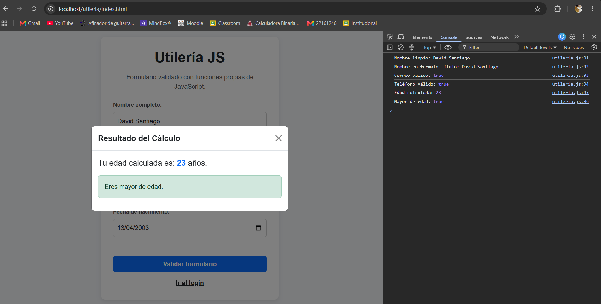
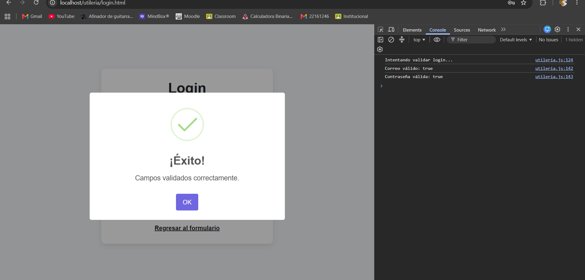
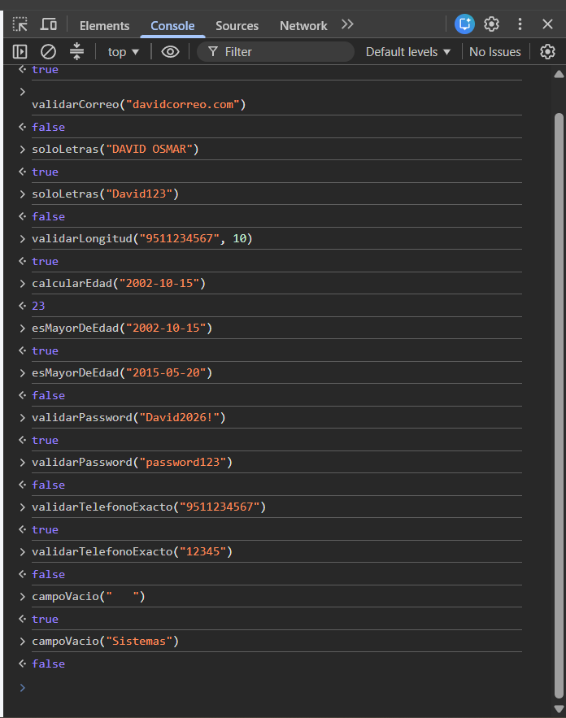

# Actividad 2 - Utilidad JS

### Portada
* **Nombre:** Santiago Vasquez David Osmar
* **Materia:** Programación Web
* **Docente:** Martinez Nieto Adelina

---

## ¿Qué problema resuelve?

Esta librería JavaScript permite validar datos comunes dentro de formularios web. Su objetivo es reutilizar funciones para validar correos electrónicos, nombres, números, fechas de nacimiento y contraseñas seguras.

El proyecto incluye una página con formulario, una ventana modal que muestra la edad calculada y una página de inicio de sesión que valida correo y contraseña.

---

## Instalación

Para usar la librería se debe enlazar el archivo `utileria.js` dentro del HTML:

```html
<script src="js/utileria.js"></script>
```
---

### Validar correo electrónico
```javascript
function validarCorreo(correo) {
    const regex = /^[^\s@]+@[^\s@]+\.[^\s@]+$/;
    return regex.test(correo);
}
```
---

## Validación de texto
```javascript
console.log(soloLetras("JESUS ALEXANDER"));
console.log(soloLetras("Ana123"));
```
---

## Validación de longitud
```javascript
console.log(validarLongitud("9511234567", 10));
console.log(validarLongitud("123456789012", 10));
```
---

## Validación de edad
```javascript
console.log(calcularEdad("2007-02-25"));
```
---

## Validación de mayor de edad
```javascript
console.log(esMayorDeEdad("2007-02-25"));
```
---

## Validación de contraseña
```javascript
console.log(validarPassword("Hola123!"));
console.log(validarPassword("hola"));
```
---

## Validación de número de teléfono
```javascript
console.log(validarTelefonoExacto(9511234567));
console.log(validarTelefonoExacto(12345));
```
---

## Validación de campo vacío
```javascript
console.log(campoVacio("   "));
console.log(campoVacio("Texto válido"));
```
---

## Capturas de pantalla de las evidencias






---

## Video de la actividad

[▶️ Haz clic aquí para ver el Video Demo Promocional de la Utilería JS](https://drive.google.com/drive/folders/1O2BgOtPp7wGWwDFdvjQ4maADOKvGkXi0?usp=sharing)